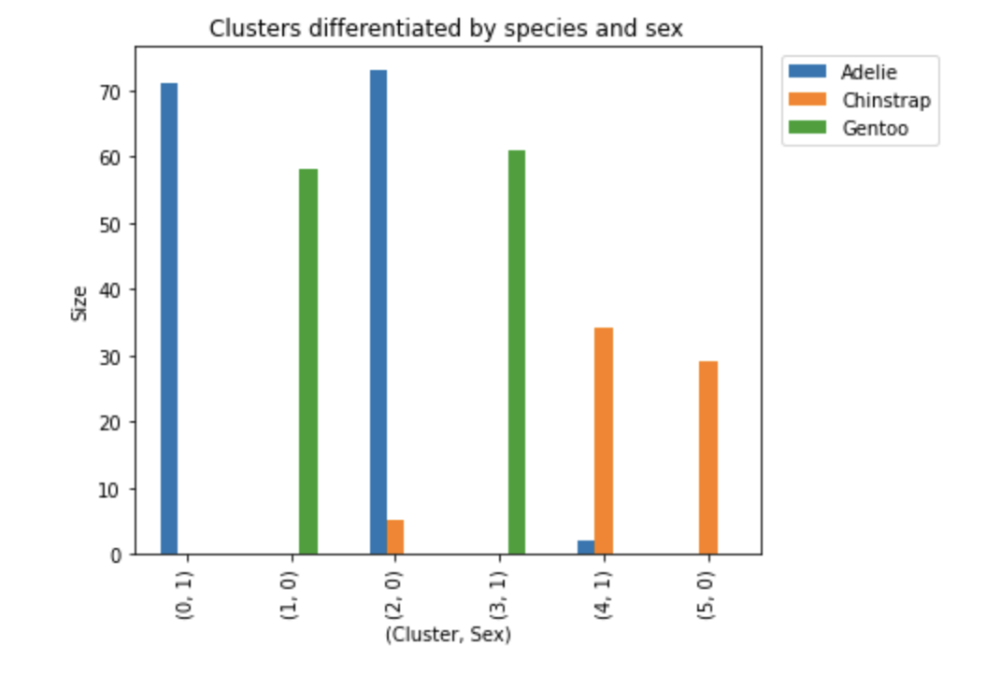

# K-means Clustering for Penguin Data

## **Project Overview**

This project applies K-means clustering to analyze a dataset of 345 penguins, aiming to uncover hidden patterns and group the penguins based on their physical characteristics. By exploring relationships between features such as flipper length, body mass, and sex, K-means clustering provides insights into species-specific characteristics and how different penguin traits form distinct clusters. The results help guide researchers and educators to better understand the species composition and physical distinctions within the penguin population.

---

## **Table of Contents**

- [Introduction](#introduction)  
- [Data Overview](#data-overview)  
- [Data Preprocessing](#data-preprocessing)  
    - Handling Missing Values  
    - Encoding Categorical Variables  
    - Feature Scaling  
- [Modeling](#modeling)  
    - Choosing the Optimal Number of Clusters  
    - Evaluating Cluster Quality  
- [Results and Interpretation](#results-and-interpretation)  
    - Cluster Assignment  
    - Cluster Analysis by Species and Sex  
    - Visualization of Cluster Results  
- [Conclusion](#conclusion)  
    - Key Insights  
    - Summary for Stakeholders 
- [How to Run](#how-to-run)

- [References](#references)

---

## **Introduction**

K-means clustering is an effective tool for segmenting data and uncovering patterns. This method is widely used across industries, particularly for its ability to group similar observations into clusters. In this project, I am tasked with using K-means clustering to help staff learn more about penguin species by identifying patterns within a dataset of 345 penguins.

The dataset includes several variables such as species, island, and sex, and the goal is to use K-means to group the penguins and discover meaningful clusters. This can help the team understand how different penguin characteristics are related and inform further research or education efforts.

---

## **Data Overview**

The dataset consists of 345 penguin samples, with the following key variables:

- **species**: The species of the penguin (Adelie, Chinstrap, Gentoo).
- **island**: The location where the penguin was found.
- **sex**: The sex of the penguin.
- **flipper_length_mm, body_mass_g, etc.**: Physical measurements of the penguins.

The primary focus of this project is to explore how K-means can segment penguins based on their physical characteristics, particularly focusing on species and sex.

---

## **Data Preprocessing**

To prepare the data for clustering, several steps were taken:

1. **Handling Missing Values**: Any rows containing missing data were removed to meet the assumption of K-means that there are no missing values.
2. **Encoding Categorical Variables**: The categorical column for sex was encoded to numeric form. The species column was excluded from clustering, as it is not being used as a feature.
3. **Feature Scaling**: To ensure that the clustering algorithm properly measures distances between data points, all numerical features were scaled using `StandardScaler`. This ensures all variables have a mean of 0 and a standard deviation of 1.

---

## **Modeling**

### **Choosing the Optimal Number of Clusters**

The optimal number of clusters is a key decision when using K-means. Although we know there are three species of penguins, K-means clustering may reveal additional relationships. The following steps were taken to determine the optimal number of clusters:

- **Inertia Calculation**: The inertia (sum of squared distances between data points and their assigned cluster centroid) was calculated for different values of `k` (number of clusters), ranging from 2 to 10. A line plot of inertia values was created to visualize the "elbow point," which indicates the optimal number of clusters.
  
- **Elbow Method**: The plot revealed an elbow at 6 clusters, suggesting this as a good number for further analysis.

### **Evaluating Cluster Quality**

- **Silhouette Score**: After identifying a potential optimal number of clusters, the silhouette score was used to assess the quality of clustering. This score measures how similar data points are within their assigned clusters compared to other clusters, with scores closer to 1 indicating better clustering.
  
- **Results**: The silhouette score was computed for `k` values between 2 and 10. The results showed that 6 clusters provided the best score, further supporting the elbow plot findings.

---

## **Results and Interpretation**

### **Cluster Assignment**

The K-means algorithm was run with 6 clusters, and the resulting cluster labels were added to the dataset. Each penguin was assigned to a cluster, allowing for further analysis of how the clusters align with known species and sex distinctions.

### **Cluster Analysis by Species and Sex**

Using groupby analysis, the clusters were examined to see how well they differentiated penguins by species and sex. While some clusters consisted primarily of a single species or sex, others contained a mix. Overall, the clustering results aligned well with known patterns of sexual dimorphism, where physical characteristics vary between males and females within species.

### **Visualization of Cluster Results**

Graphs were created to visualize how each cluster corresponds to species and sex. The visualization clearly indicated that most clusters were predominantly composed of a specific species and sex, reinforcing the model’s effectiveness in identifying meaningful groupings.



---

## **Conclusion**

### **Key Insights**

- The K-means model identified 6 clusters in the penguin dataset, largely corresponding to the known species and sexual dimorphism.
- Data preprocessing steps, including handling missing values, encoding categorical variables, and scaling features, were crucial to ensure accurate clustering results.
- The elbow plot and silhouette score both indicated that 6 clusters were optimal for this data.
- The clusters revealed important patterns, with each cluster typically dominated by a specific penguin species and sex, offering valuable insights into the physical characteristics of penguins.

### **Summary for Stakeholders**

The K-means clustering model successfully segmented the penguins into groups that reflect known species and sex differences. These results can help team members better understand penguin characteristics and apply clustering methods to other research areas.

---
## How to Run

1. **Clone the repository**:

    ```bash
    git clone <https://github.com/MahmoudKhaled98/K-means-Clustering-for-Penguin-Data.git>
    ```

2. **Install the required dependencies**:

    ```bash
    pip install -r requirements.txt
    ```

3. **Run the Jupyter notebook**:

    ```bash
    jupyter notebook
    
## **References**


- [Gorman, Kristen B., et al. “Ecological Sexual Dimorphism and Environmental Variability within a Community of Antarctic Penguins (Genus Pygoscelis).” PLOS ONE, vol. 9, no. 3, Mar. 2014, p. e90081. PLoS Journals](https://doi.org/10.1371/journal.pone.0090081)

- [Sklearn Preprocessing StandardScaler scikit-learn](https://scikit-learn.org/stable/modules/generated/sklearn.preprocessing.StandardScaler.html)

- [Pandas Documentation](https://pandas.pydata.org/)
- [NumPy Documentation](https://numpy.org/doc/stable/)
- [Scikit-learn Documentation](https://scikit-learn.org/stable/)
- [Seaborn Documentation](https://seaborn.pydata.org/)
- [Matplotlib Documentation](https://matplotlib.org/stable/contents.html)
